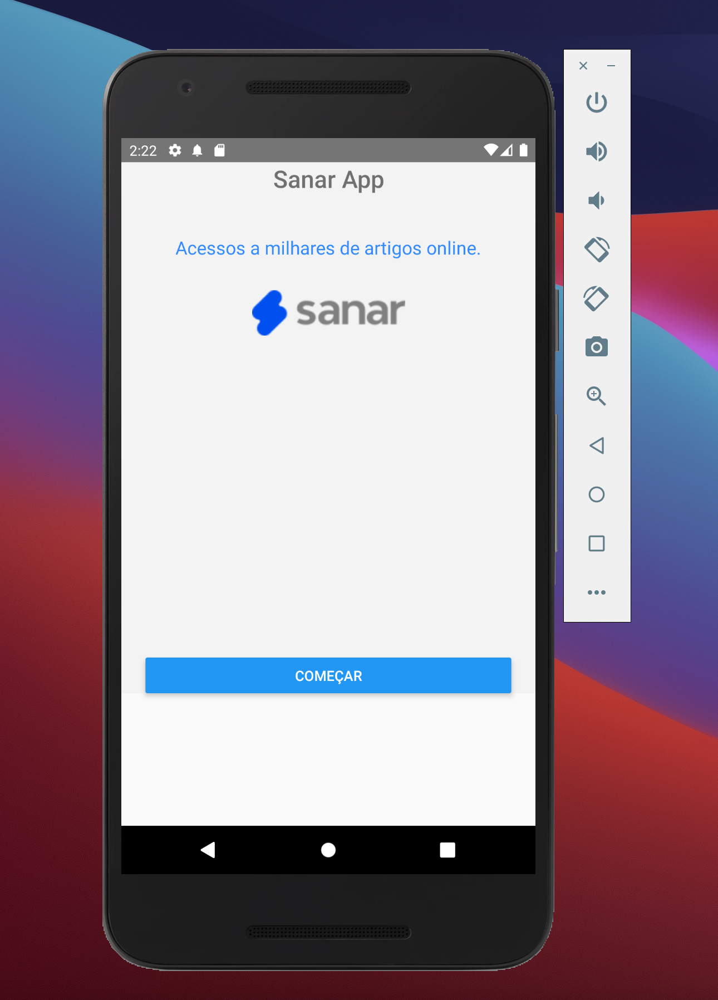

# Sanar Intern Challenge Mobile
Este é um desafio que vai ajudar a identificar seus pontos fortes como uma pessoa desenvolvedora mobile na Sanar.

<div align="center">
  
</div>


`
O objetivo desse desafio é construir um aplicativo utilizando a tecnologia React Native e com isso demonstrar suas habilidades técnicas e domínio do framework fazendo o uso dessa tecnologia.
`

## Problema: ❓

As usuárias da sanar são super profissionais que desejam impactar e revolucionar a sáude do mundo, para isso será necessário que elas estudem bastante
com os artigos mais renomados publicados na revista HealthCare, essa revista publica varios artigos e o recomendado é que as profissionais realizem uma leitura diária. Porém elas estão ocupadas em suas rotinas que podem ser dentro de salas de aulas, realizando a residência médica ou realizando atendimentos, com isso elas estão longe de seus escritórios ou local de estudos e não estão conseguindo se atualizar. Nossa super PO e lideranças estratégicas identificaram que um novo produto, sendo mais específico uma App pode resolver essa dor.

## Solução 🚀

Criar um aplicativo que organize a leitura dos artigos da revista HealthCare.

## Instruções 📖

* Prefira realizar o seu próprio código do que utilizar bibliotecas ou componentes prontos.
* Fazer o uso dos artigos da API: 'https://www.healthcare.gov/api/articles.json'.
* Sua solução deve ter no mínimo 3 telas tela obrigátorios que estão disponíveis no nesse figma https://www.figma.com/file/U67le6ZsSSb0XOgU4F7COC/Est%C3%A1gio-%2F-2022.1?node-id=2%3A274 e ao menos mais 1 tela de livre escolha e no máximo 2 para organização dos artigos.

### Tecnologias
* Precisamos que você faça essa etapa utilizando o framework do React Native.

### Telas A serem desenvolvidas
1. Boas Vindas
2. Login
3. Registro
4. Primeira tela de artigos (Bônus)
5. Segunda tela de artigos  (Bônus)

#### Regras de validação do campo de senha 🔑
1. Pelo menos 1 caractere maiúsculo.
2. Pelo menos 1 caractere minúsculo.
3. Pelo menos 1 dígito.
4. Pelo menos 1 caractere especial.
5. Mínimo de 8 caracteres.

#### Regras de validação do campo do email 📧
1. @ simbolo.
2. Nome do domínio (Ex: sanar.com).
3. Nome do receptor (Ex: developer).
4. Digitos de 0 até 9
5. apenas os caracteres especiais: Ponto (.), Underline (_), Hífen (-) e Mais (+).

### Recomendações 🌈
* Você deve usar os métodos do arquivo loginAPI para criar uma nova usuária ⭐️
* Você deve usar os métodos do arquivo loginAPI para realizar a autenticação do login ⭐️
* Você deve usar a API da HealthCare do governo dos USA como nossa provedora de artigos https://www.healthcare.gov/api/articles.json ⭐️
* Faça o uso de bibliotecas como Axios ou Fetch para requisições http ⭐️
* Codem pensando na melhor experiência da usuária ♥️

## Entrega 📦

* Criar uma conta no GitHub e fazer um fork desse projeto 1️⃣
* Commitar o código fonte 2️⃣
* Dar acesso as pessoas X para realizar a revisão de código 3️⃣

## Dependências 🏬

* Node v16.11.1 (recomendo instalar via [NVM](https://github.com/creationix/nvm))
* [React Native Cli](https://www.npmjs.com/package/react-native-cli)
* [Yarn](https://yarnpkg.com)
* cd ios && npx pod-install (se for desenvolver para iOS)


#### Instalar dependências 🏗

Em um terminal:

```bash
npm install # instalar dependências
npm run android # iniciar o metro bundler + abrir simulador android
npm run ios # iniciar o metro bundler + abrir simulador iOS
npm test # executar testes unitários
```

```bash
yarn # instalar dependências
yarn android # iniciar o metro bundler + abrir simulador android
yarn ios # iniciar o metro bundler + abrir simulador iOS
yarn test
```

## Dicas ⌨️

* Um código bem organizado e seguindo algum padrão de projeto é sempre bem vindo
* A capacidade de criar interfaces utilizando boas praticas é sempre um diferencial interessante
* Fique a vontade para inovar ou mostrar as coisas que você mais goste
* Se divirta
* Qualquer problema entre em contato com a gente.

## Boa Sorte! 🍀🍀🍀🍀
